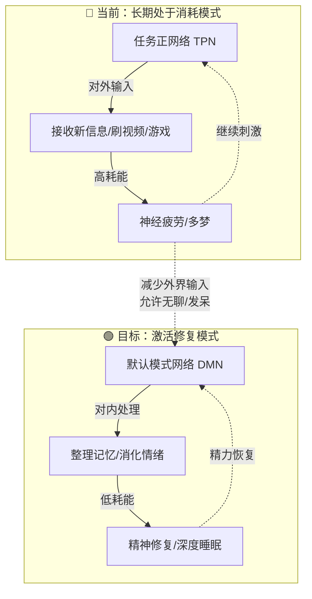
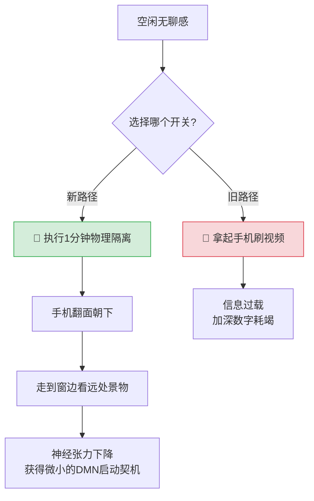

# 个人状态复原与数字耗竭应对指南

## 🔍 第一部分：现状因果分析（自我诊断）

### 1. 看似休息，实则大脑超负荷（数字耗竭）
- 短视频、游戏、影视解说属于**高密度信息流**。即便半走神，视觉听觉仍在接收新内容，大脑后台持续处理。
- 经常将视频/解说作为房间“背景音” → 进一步加重神经负担。
- **结论**：眼球跳动、脑子停不下来 = 神经与眼肌疲劳的信号。

### 2. 睡眠时长足够，但属于“无效睡眠”
- 睡前持续强信息刺激 → 大脑皮层亢奋 → 入睡后**睡眠变浅、梦境繁多**。
- 做梦本质是大脑在加班处理白天堆积的碎片信息 → 醒后头胀、无恢复感。
- 身体疲惫但神经唤醒度高 → 中午困却睡不着。

### 3. 行为自动化闭环
- 仅做饭、逗狗是与现实的连接；一旦空闲，**立刻**退回电子屏幕。
- 条件反射：空闲空档出现 → 本能打开设备填满空白（非意志力差，而是缺乏缓冲环节）。

### 4. 心理层面：对空白/无聊的逃避
- 暑假无外部学业目标 → 产生空虚沉闷感。
- 本能用网络内容掩盖空洞 → **恶性循环**：害怕无聊→刷信息流→神经透支→更沉闷→继续刷。

### 5. 环境放大问题
- 长期密闭空调房，仅傍晚短触户外 → 自然光不足，干扰神经调节与睡眠节律。

> **重要判断**：非抑郁，非懒惰。属于**典型假期数字耗竭**，保有现实行动力，但精神神经系统被持续消耗。

---

## 🧠 第二部分：核心认知——大脑的两种模式

1. 任务正网络 (TPN) —— 我目前的主要状态

· 场景：刷视频、打游戏、学习、专注做饭思考。
· 特点：注意力向外，持续解读外界信息，消耗神经能量。
· 注意：身体躺着≠大脑休息，只要接收新信息，大脑就在工作。

2. 默认模式网络 (DMN) —— 我极度缺少的状态

· 触发：大幅减少外界新信息输入时（清醒即可触发）。
· 场景：发呆、望景出神、胡思乱想、回忆（不被视频强行牵引）。
· 功能：整理记忆缓存、消化情绪、神经自我修复。

⚠️ 三大关键误区

1. DMN 不需要大脑空白，允许胡思乱想；忌讳的是旧念头未消化又涌入新信息。
2. 身体躺平 ≠ 精神休息（躺着刷手机仍是输入模式）。
3. 播客/解说音频 ≠ 休息；风声、虫鸣这类无叙事的自然声音负荷才低。

我的核心困境：几乎不给DMN运行时间。白天信息积压全部推给夜间睡眠 → 多梦、疲惫。
信号识别：短暂的“无聊感”，正是大脑准备自我修复的求救信号。

---

✅ 第三部分：什么是真正的休息（纠偏清单）

❌ 错误休息（高刺激娱乐） ✅ 真正精神休息（激活DMN）
刷短视频、打竞技游戏、看解说 降低外界新信息输入，转向处理自身记忆与情绪
躺着听播客/有声书（有剧情） 发呆、走神、回忆、做不动脑的简单家务

大脑三种状态区分：

· 对外输入：接收外部信息（学习、娱乐）→ 消耗精力
· 默认模式漫游：清醒发呆少输入 → 清醒时的精神修复
· 睡眠状态：夜间修复；白天信息过载会加重梦境，降低睡眠质量

---

🛠️ 第四部分：可执行缓解策略（行动处方）

一、即时急救（脑袋胀、眼球跳时立刻做）

1. 掌心捂眼：搓热双手，遮光捂眼 3-5分钟，同时关闭所有视频/音频。
2. 无手机户外：不带手机去院子 5分钟，单纯看现实景物，听自然声音，念头随意飘。
3. 慢呼吸：吸气4秒 → 屏息2秒 → 呼气6秒，重复数轮。

二、白天空闲替代（替换无意识刷手机）

做完饭后：

· 洗碗、擦灶台、整理桌面；
· 院子慢走、拉伸肩颈、眼部远眺；
· 整理房间、叠衣物。

⚠️ 铁律：做这些事时保持安静，不放解说/视频当背景音。

三、中午困但睡不着

· 手机放远，闭眼躺 20分钟 即可。
· 睡不着也没关系，闭目即是休息；脑子乱就改为坐着闭目养神。

四、傍晚与睡前（改善多梦与无效睡眠）

1. 傍晚卸荷：傍晚院子活动不带手机，留出一段无屏幕时间，提前卸掉一天的信息负荷。
2. 睡前一小时：停止短视频、游戏、高强度影视。换成发呆、简单收拾、翻几页闲书。
3. 床只用来睡觉：不要躺床上刷视频（打破条件反射）。

---

🧾 第五部分：简单自我约束（微习惯规则）

1. 短视频管理：设置集中刷的时段，刷完立即退出APP，不放在后台，不随时点开。
2. 杜绝背景音：房间内不持续播放解说类、剧情类音频（可替换为无叙事自然白噪音）。
3. “一分钟断连”仪式：任何空闲时刻，先强制自己看远处或做一件实物家务（如擦桌子），一分钟后再决定是否玩手机（通常冲动会减弱）。

---

📝 复盘备注（待更新）

行动一周后，在此记录身体感受与睡眠变化。重点观察：晨起头胀是否减轻、中午困倦时能否小憩、眼球跳动频率。
